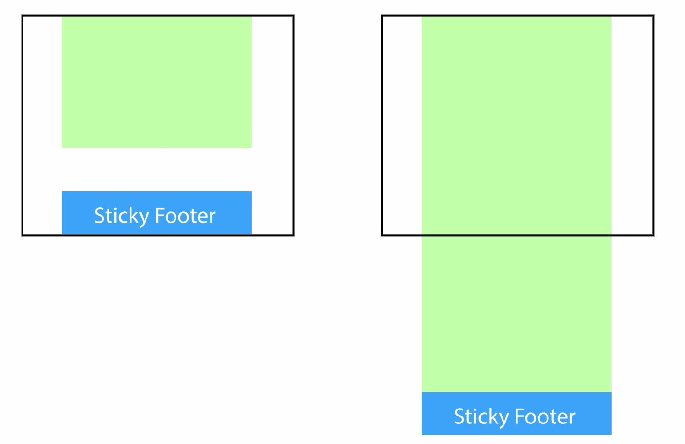

# perfect-footer

解决页面中关于footer的常见问题：
- 页面内容少不足一屏幕，footer显示在当前屏幕底部
- 页面内容多footer在页面底部

view online demo:
[https://cdn.rawgit.com/FrankFan/sticky-footer/8795767b/index.html](https://cdn.rawgit.com/FrankFan/sticky-footer/8795767b/index.html)

